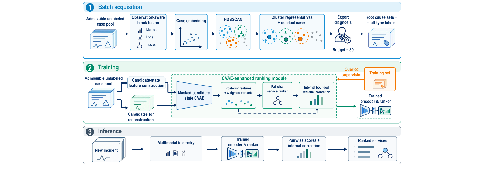

# VAST: Multimodal Active Learning and CVAE-Enhanced Ranking

**Microservice root cause localization with limited incident annotations.**

VAST selects representative historical incidents for annotation, learns candidate-service representations from admissible training observations, and trains a supervised service ranker. Given a new incident, it returns an ordered list of candidate root cause services.

This repository provides the **VAST method implementation**, version **1.0.0**. It is not the paper's experiment suite. Benchmark data, prepared feature bundles, frozen query plans, trained weights, and scripts for reproducing the complete experimental comparisons are not distributed here.

**Start here:** [install the method](#installation), run the [data-free checks](#quick-start-without-benchmark-data), then follow the [input contract](#input-contract) to run the complete pipeline with your prepared inputs.

## Contents

- [Method overview](#method-overview)
- [Installation](#installation)
- [Quick start without benchmark data](#quick-start-without-benchmark-data)
- [Input contract](#input-contract)
- [Running VAST](#running-vast)
- [Outputs and verification](#outputs-and-verification)
- [Fixed method configuration](#fixed-method-configuration)
- [Paper and repository scope](#paper-and-repository-scope)
- [Repository guide](#repository-guide)
- [Citation and contact](#citation-and-contact)

## Method overview



VAST uses two representations for two different decisions. A **case-level embedding** compares complete incidents for acquisition. A **candidate-level representation** preserves differences between services for ranking within an incident.

1. **Multimodal acquisition.** Metric, log, trace, and topology features are pooled across candidate services using their mean, maximum, and standard deviation. Window duration supplies temporal context. Observed-value standardization and block-distance balancing precede concatenation and PCA. HDBSCAN groups similar cases, and medoid-centered selection allocates a batch of queries under a fixed budget.
2. **Candidate-state learning.** A factorized conditional variational autoencoder (CVAE) represents local responses, propagation-related state, and context. Reconstruction and its label-free regularizers use **all admissible training incident observations**, including queried and unqueried cases. Only queried root cause and fault-type labels contribute to type regularization.
3. **Supervised ranking.** The **localization model is a pairwise linear logistic ranker with a bounded correction**, not the CVAE itself. The ranker combines historical service features with the CVAE's 48-dimensional candidate representation. Its preference labels come **only from annotated cases**. Posterior variants change latent coordinates while preserving each annotated case's candidates, historical features, and labels.
4. **Bounded correction and inference.** Internal cross-type episodes train a gated residual correction, called OSER in the implementation. The correction is bounded to 0.05 score units. At inference, frozen encoders supply posterior means, the ranker scores candidates, and an eligible correction refines those scores. No labels, decoding, posterior sampling, or parameter updates are required.

| Stage | Observations used | Labels used |
|---|---|---|
| Acquisition and fusion fitting | Admissible training case pool | None |
| CVAE reconstruction and label-free regularization | Queried and unqueried training cases | None |
| CVAE type regularization | Queried root cause candidates | Queried root cause and fault-type labels |
| Pairwise ranking and internal correction | Queried cases and their posterior variants | Queried labels only |
| Inference | New incident's observable candidate features | None |

Unqueried cases do not supply preference labels or pseudo-labels. Test observations are not part of the training pool. Availability describes whether observations are present, not whether they reveal the true root cause. Propagation-related features are observable proxies, not recovered causal paths.

Root labels supplied with the test bundle are used only for evaluation and report validation, not as model inputs or training supervision.

## Installation

### Controller

Use a **full Linux checkout** and **Python 3.12**. The runner uses Linux `fcntl` locks. Windows can be used for inspection and source checks, but the full training runner is not supported natively.

```bash
git clone https://github.com/molujia/VAST.git
cd VAST
python3.12 -m venv .venv
source .venv/bin/activate
python -m pip install -e '.[test]' \
  numpy==2.1.3 pandas==2.2.3 scipy==1.14.1
```

The package is named `vast-rcl` and imported as `vast`. Keep the checkout because execution also uses repository scripts and the source inventory. The command pins the reference numerical libraries. [Package metadata](pyproject.toml) permits broader versions, but numerical equivalence across versions is not guaranteed.

### PyTorch worker

The controller launches a separate interpreter configured through `worker_python`. Installing the controller **does not install PyTorch into that interpreter**.

The reference worker uses Python 3.8.18, NumPy 1.21.5, and PyTorch 2.4.0 with CUDA 12.1. With Conda available:

```bash
conda create -n vast-worker python=3.8.18 numpy=1.21.5 pip
conda run -n vast-worker python -m pip install torch==2.4.0 \
  --index-url https://download.pytorch.org/whl/cu121
conda run -n vast-worker python -c 'import sys; print(sys.executable)'
```

Set `worker_python` to the printed interpreter path. Run controller commands from the controller environment. The controller passes the checkout's source path to the worker automatically.

| Component | Reference environment |
|---|---|
| Controller | Python 3.12, NumPy 2.1.3, pandas 2.2.3, SciPy 1.14.1, scikit-learn 1.5.2 |
| Worker | Python 3.8.18, NumPy 1.21.5, PyTorch 2.4.0+cu121 |
| GPU | NVIDIA RTX A6000 with a CUDA-compatible driver |

CPU execution is supported with `"device": "cpu"` and a compatible PyTorch installation. This table identifies the reference environment, not a minimum hardware requirement or a portability guarantee. See [environment and numerical replay](docs/reproducibility.md#environment-and-numerical-replay).

## Quick start without benchmark data

With the controller installed, run:

```bash
python -c 'from vast import describe_method; print(describe_method())'
python scripts/run_vast.py --help
python -m pytest -q
python -m tools.snapshot_sources --destination-root . --verify-only
python tools/repository_firewall.py .
```

These commands inspect the selected implementation, display the CLI, exercise the controller tests, verify copied-source integrity, and check the publication boundary. They do not download data or reproduce benchmark accuracy.

Run the full test suite on Linux. For a limited Windows check, replace `python -m pytest -q` with:

```bash
python -m pytest -q --ignore=tests/test_vae_snapshot_execution.py
```

This excludes Linux-dependent execution and stage-reuse tests and is not a full-suite validation.

The method description should identify version `1.0.0`, method `B`, eight posterior samples, and posterior-mean inference. The source-inventory and repository-firewall checks should exit successfully.

For an **optional end-to-end synthetic smoke test**, use Linux and an installed worker:

```bash
VAST_WORKER_PYTHON=/opt/conda/envs/vast-worker/bin/python \
  python -m pytest tests/test_cli_smoke.py -q \
  --basetemp=/srv/vast-checks/pytest-smoke
```

Replace the worker path with your interpreter. The test creates synthetic feature rows, trains a bounded smoke model, checks rankings and reports, resumes the run, and verifies rejection of modified inputs. Without `VAST_WORKER_PYTHON`, this integration test is skipped. Synthetic scores are not scientific results.

## Input contract

VAST's public runner starts from **prepared numerical feature tables**, not directly from raw telemetry. Feature extraction and benchmark distribution are outside this repository's scope.

| File or plan | Required content |
|---|---|
| `windows.csv` | Unique `window_id`, window metadata and timestamps, and root-label metadata. Multiple root candidates in `positive_ids` are separated by semicolons. |
| `entity_features.csv` | One row per `(window_id, entity_id)`, complete candidate inventory, entity metadata, availability indicators, and original numerical feature columns. |
| `metadata.json` | Ordered `all_feature_columns`. Preserve names and order. |
| Split manifest | Frozen `outer_train_case_ids` and `outer_test_case_ids`. The runner independently checks the chronological split. |
| Acquisition query plan | For `query_only`: a complete validated budget-30, seed-42 plan, including ordered selected IDs and provenance hashes. A bare ID list is insufficient. |
| Historical supervision plan | Optional. Supply it when the original supervision order must be preserved for numerical replay. |

Candidate services are represented by `entity_id` in the implementation. Preserve the dataset's identity mapping and complete candidate frame rather than filtering or renaming rows arbitrarily.

The supported dataset identifiers are `rcabench` for **D1** and `aiops2022_pre` for **D2**. D2 retains the historical feature-directory alias `hd1`. Adding a new dataset requires a compatible input adapter and identity mapping, not just changing its name in the runtime JSON.

For `query_only`, acquisition fixes the query plan before root cause and fault-type labels are admitted. The runner consumes this frozen plan. [`scripts/select_queries.py`](scripts/select_queries.py) can generate it from the external acquisition inputs described in the [detailed contract](docs/reproducibility.md#regenerating-an-acquisition-plan). No expert-annotation interface is included.

**Important:** provide the complete feature inventory and original availability semantics. A reduced illustrative table is suitable for a software smoke test, not a substitute for the method's full ranking inputs.

## Running VAST

Run these commands from the checkout with the controller environment active.

### 1. Configure your inputs

Copy [`configs/runtime.example.json`](configs/runtime.example.json) to a location outside the checkout and edit the paths. A minimal one-dataset configuration is:

```json
{
  "schema_version": "vast-runtime-v1",
  "output_root": "/srv/vast-runs/method-smoke",
  "worker_python": "/opt/conda/envs/vast-worker/bin/python",
  "device": "cuda:0",
  "regimes": ["query_only"],
  "datasets": [
    {
      "dataset_id": "rcabench",
      "feature_dir": "/srv/vast-inputs/features/rcabench",
      "split_manifest": "/srv/vast-inputs/rcabench-split.json",
      "query_plan": "/srv/vast-inputs/rcabench-center-seed42.json"
    }
  ]
}
```

Paths are examples for **inputs you supply**, not download locations. Relative paths resolve against the runtime JSON's directory. Keep `output_root` outside the checkout and separate from all input files and directories.

The runtime supports `query_only` and `oracle_full`. Query-only uses the selected annotations. Oracle-full uses all outer training fault labels and may omit `query_plan`. It is a fully labeled control, not a guaranteed accuracy upper bound.

### 2. Prepare and smoke-test

Save the configuration as `/srv/vast-inputs/runtime-smoke.json`, then run:

```bash
python scripts/run_vast.py run \
  --runtime /srv/vast-inputs/runtime-smoke.json --mode smoke --prepare-only
python scripts/run_vast.py run \
  --runtime /srv/vast-inputs/runtime-smoke.json --mode smoke --resume
python scripts/run_vast.py report --output /srv/vast-runs/method-smoke
```

Preparation creates the manifest, so the next command needs `--resume`. Smoke uses three supervised cases, three test cases, and five CVAE updates. Reports are marked `bounded_debug_only`. Small groups can trigger a recorded correction fallback. Smoke checks execution, not localization effectiveness.

### 3. Run the complete method

Create `runtime-formal.json` with a **new** `output_root`, such as `/srv/vast-runs/method-formal`:

```bash
python scripts/run_vast.py run \
  --runtime /srv/vast-inputs/runtime-formal.json --mode formal
python scripts/run_vast.py status --output /srv/vast-runs/method-formal
```

The first command runs training and ranking with the fixed recipe. Use another terminal for `status`, or run it after the first command finishes. Here, `formal` means the complete method run, not reproduction of the paper's entire experiment suite.

After an interruption, resume the same compatible run:

```bash
python scripts/run_vast.py run \
  --runtime /srv/vast-inputs/runtime-formal.json --mode formal --resume
python scripts/run_vast.py report --output /srv/vast-runs/method-formal
```

Use the same inputs, code, worker environment, and mode when resuming. The runner rejects identity mismatches rather than silently reusing incompatible stages.

## Outputs and verification

| Output | What to inspect |
|---|---|
| `manifest.json`, `config.frozen.json` | Configuration, source/input hashes, and environment identity |
| `heartbeat.json` | Most recently recorded active and queued units |
| `units/<unit_id>/controller.log`, `status.json` | Unit progress and errors |
| Worker-stage `progress.json`, `worker.log` | Training/encoding counters and diagnostics |
| `units/<unit_id>/unit.done.json` | Verified unit completion and result-artifact path |
| `run.done.json` | Successful collection of all requested units |
| `run.failed.json` | Recorded run failure |

The unit result references the complete candidate-ranking artifact. `report` checks result hashes, candidate inventories, root labels, and metric calculations without training. Its JSON includes final `metrics` and `pre_OSER_metrics`. A checkpoint or a stale heartbeat alone does not establish completion.

The runner reports Hit@1/3/5, MRR, and `TOP135`. **TOP135 averages three cutoffs and is not the paper's Avg@5**, which averages Top@1 through Top@5. Do not relabel one as the other. Multiple-root cases use the best true-root position. See [execution and recovery](docs/reproducibility.md#execution-and-recovery) for troubleshooting and [archived metric definitions](docs/evaluation.md#metrics-and-ordinary-populations).

## Fixed method configuration

[`src/vast/default_config.json`](src/vast/default_config.json) is the authoritative method configuration.

| Component | Default |
|---|---|
| Acquisition PCA | At most 32 components, capped by numerical rank |
| HDBSCAN | Euclidean distance, leaf selection, medoid-centered acquisition |
| D1 / D2 clustering | Minimum cluster size/sample count: 5/5 and 6/2 |
| Annotation budget | 30 original incident cases |
| Candidate-state blocks | Local response 11, propagation-related state 6, context 10 |
| CVAE latents | Three 16-dimensional factors, 48 dimensions in total |
| Posterior augmentation | Eight variants per annotated case, combined relative weight 0.25 |
| Base ranker | L2-regularized linear logistic classifier using pairwise differences |
| Correction | Gated residual bounded to 0.05, inference gate threshold 0.5 |
| Released runner seed | 42 |

The acquisition embedding and candidate latents are not interchangeable. Historical features remain separate from the CVAE factors. The released ranking inputs contain **488 + 48 = 536** coordinates on D1 and **168 + 48 = 216** on D2.

Normal windows may contribute to historical baselines but do not become additional labeled fault cases. Internal held-type episodes regularize the correction using queried types. They are not an external leave-one-fault-type-out experiment.

The runtime JSON selects infrastructure and input paths. It does not provide switches for arbitrary scientific sweeps. Exact objective weights, training settings, and historical field-name caveats are documented in [fixed scientific configuration](docs/reproducibility.md#fixed-scientific-configuration).

## Paper and repository scope

The accompanying manuscript is:

> **VAST: Multimodal Active Learning and CVAE-Enhanced Ranking for Microservice Root Cause Localization**
>
> Runzhou Wang, Shenglin Zhang, Wenwei Gu, Yongxin Zhao, Chenyu Zhao, and Dan Pei.

The paper reports standard localization, modality ablations, acquisition comparisons, component and type-exclusion studies, and parameter sensitivity. This method repository does not include their experiment drivers or data and does not claim that a single public command regenerates those tables and figures.

The released runner is fixed to seed 42. The final manuscript's five-seed experiments use seeds 40–44. The pre-existing [evaluation summaries](docs/evaluation.md) and [aggregate JSON](docs/evaluation-summary.json) retain earlier release evidence, including a separate three-seed study. They are historical records, not the final manuscript's five-seed result package. [Source provenance](docs/provenance/README.md) documents the implementation's release checks.

<a id="released-b-seed-42"></a>
For earlier seed-42 results, see the archived evaluation records above. They must not be substituted for the final paper's reported means.

## Repository guide

```text
src/vast/                  Public runtime and fixed method configuration
src/vast/_historical/      Preserved historical feature/training dependencies
src/rcl_study/             Candidate CVAE, pairwise ranking, correction, stage reuse
src/fixed_active_learning/ Multimodal acquisition and query-plan validation
scripts/                   Method execution and query-selection entry points
configs/                   Runtime path template
tests/                     Regression, contract, and optional synthetic CLI checks
tools/                     Source-integrity and repository-publication checks
docs/                      Input/execution contracts, provenance, and overview image
```

Historical names such as `B`, `mechanism`, and `OSER` are retained in code to preserve validated numerical behavior. In the paper, these correspond to the complete VAST ranking pipeline, local-response factors, and internal bounded correction. Old helper filenames do not imply additional public CLI modes.

## Citation and contact

Software citation metadata is provided in [`CITATION.cff`](CITATION.cff). Record version **1.0.0** and the exact commit you use. Cite the accompanying manuscript separately when discussing its scientific findings. No publication venue or DOI has been assigned in this repository's citation record.

For questions and bug reports, use [GitHub Issues](https://github.com/molujia/VAST/issues). Include the commit, controller/worker versions, command, and relevant error message. Do not attach private telemetry, credentials, or trained artifacts containing sensitive incident information.

**License:** VAST is released under the [MIT License](LICENSE). Third-party dependencies and benchmarks remain subject to their own licenses and access terms.
