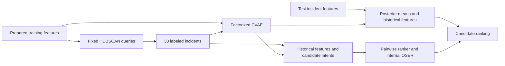

# VAST

**Root cause ranking for microservice failures with limited labeled incidents.**

VAST combines fixed active querying, complete historical features, continuous candidate representations learned by a factorized conditional variational autoencoder (CVAE), and an internal OSER residual correction. Given a prepared incident feature bundle, it returns a ranking of candidate root cause entities.

This repository contains **version 1.0.0, the final continuous-latent B implementation**. Its default experiment uses 30 labeled training incidents, eight posterior variants per labeled incident, and seed 42. An Oracle-full setting uses every labeled incident in the outer training split. The released method and scientific defaults are fixed.

**Start here:** use a full Linux checkout and supply the prepared inputs described below. Source code, configuration, tests, and aggregate results are included. Benchmark feature bundles, query plans, trained weights, and case-level experiment outputs are external inputs and are not distributed in this repository.

## Contents

- [Method overview](#method-overview)
- [Installation](#installation)
- [Data and configuration](#data-and-configuration)
- [Running VAST](#running-vast)
- [Results](#results)
- [Running time](#running-time)
- [Reproducibility and limitations](#reproducibility-and-limitations)
- [Verification](#verification)
- [Repository guide](#repository-guide)
- [Project information](#project-information)

## Method overview

VAST learns from the outer training incident pool and ranks every candidate in a test incident. Root cause and fault type labels are restricted to the authorized supervision set; test labels are used for evaluation.



1. **Choose the supervision.** HDBSCAN leaf clustering and center selection operate on an unlabeled multimodal PCA representation of the training pool. Query-only uses 30 selected incidents. Oracle-full bypasses querying and uses all outer training labels.
2. **Learn candidate representations.** The CVAE has mechanism, propagation, and context factors, each with a 16-dimensional latent. It fits observable states from the full outer training fault pool. A triplet term uses only authorized root candidates and fault type labels.
3. **Train with continuous variation.** Each labeled incident keeps its complete historical feature rows and receives a 48-dimensional candidate latent. Training includes the posterior mean and eight Gaussian posterior variants. The variants preserve the original candidate inventory and root labels; their combined pairwise weight is 0.25 times the real parent's weight.
4. **Rank and refine.** A pairwise linear ranker uses separately standardized historical and latent features. Internal OSER applies a gated residual correction bounded to 0.05 score units. Inference uses posterior means and observable features, with no root cause or fault type labels.

The release retains the full historical feature representation: **488 + 48 = 536** dimensions for RCABench and **168 + 48 = 216** for AIOps22-pre. Latent variation does not decode new telemetry or move a root cause to another service. See [fixed parameters and exact semantics](docs/reproducibility.md#fixed-scientific-configuration).

## Installation

### Controller

The execution target is **Linux**; the runtime uses `fcntl` file locks. Use **Python 3.12** for the controller. Package metadata allows `>=3.12,<3.15`, but the reference environment was validated on 3.12.

```bash
git clone https://github.com/molujia/VAST.git
cd VAST
python3.12 -m venv .venv
source .venv/bin/activate
python -m pip install -e '.[test]'
```

Keep the full checkout: the workflow uses repository scripts and a source inventory in addition to the installed Python packages. The package name in [pyproject.toml](pyproject.toml) is `vast-rcl`; installation here is from source.

### PyTorch worker

The controller launches a separate interpreter specified by `worker_python`. The editable installation above does **not** install PyTorch into that interpreter. The reference environments were:

| Component | Reference environment |
|---|---|
| Controller | Python 3.12; NumPy 2.1.3; pandas 2.2.3; SciPy 1.14.1; scikit-learn 1.5.2 |
| Worker | Python 3.8.18; NumPy 1.21.5; PyTorch 2.4.0+cu121 |
| Accelerator | NVIDIA RTX A6000; CUDA 12.1 |

For example, with Conda available, create a dedicated worker environment:

```bash
conda create -n vast-worker python=3.8.18 numpy=1.21.5 pip
conda run -n vast-worker python -m pip install torch==2.4.0 \
  --index-url https://download.pytorch.org/whl/cu121
conda run -n vast-worker python -c 'import sys; print(sys.executable)'
```

Use the printed interpreter path in the runtime JSON. Run VAST commands from the controller environment. The checkout's source path is passed to the worker automatically. A compatible NVIDIA driver is required for CUDA execution; `"device": "cpu"` is also supported. Environment and thread choices affect numerical replay; see [environment identity](docs/reproducibility.md#environment-and-numerical-replay).

## Data and configuration

### Required inputs

VAST starts at the **prepared feature bundle**. The public entry point does not extract benchmark features directly from raw logs, metrics, or traces.

```text
/srv/vast-inputs/
├── features/rcabench/
│   ├── windows.csv
│   ├── entity_features.csv
│   └── metadata.json
├── rcabench-split.json
├── rcabench-center-seed42.json
├── rcabench-query-supervision.json
└── runtime-smoke.json
```

All paths in the examples are illustrative locations for **inputs you supply**.

| Input | Required content |
|---|---|
| `windows.csv` | Unique `window_id`; dataset, fault/normal kind, timestamps, and label metadata. `positive_ids` contains semicolon-separated true root entities. |
| `entity_features.csv` | One row per `(window_id, entity_id)`, with the full candidate inventory, historical metadata, and original feature columns. |
| `metadata.json` | `all_feature_columns`, preserving feature names and order. |
| Split manifest | Frozen `outer_train_case_ids` and `outer_test_case_ids`. The runtime independently reconstructs and checks the chronological split. |
| Acquisition query plan | Query-only: the complete validated seed-42, budget-30 HDBSCAN/center plan, including its ordered IDs and hashes. A bare ID list is insufficient. |
| Historical supervision plan | Optional for execution; supply the original plan for reference replay, particularly to preserve Oracle training order. |

The [input contract](docs/reproducibility.md#input-contract) explains the schemas, order requirements, label boundary, and query-plan generation. Preserve the complete feature inventory: the table above describes the files, not a reduced replacement feature set.

### Runtime JSON

Save this as your external `runtime-smoke.json` and replace the paths:

```json
{
  "schema_version": "vast-runtime-v1",
  "output_root": "/srv/vast-runs/B-seed42-smoke",
  "worker_python": "/opt/conda/envs/vast-worker/bin/python",
  "device": "cuda:0",
  "regimes": ["query_only"],
  "datasets": [
    {
      "dataset_id": "rcabench",
      "feature_dir": "/srv/vast-inputs/features/rcabench",
      "split_manifest": "/srv/vast-inputs/rcabench-split.json",
      "query_plan": "/srv/vast-inputs/rcabench-center-seed42.json",
      "supervision_plans": {
        "query_only": "/srv/vast-inputs/rcabench-query-supervision.json"
      }
    }
  ]
}
```

The [complete example](configs/runtime.example.json) includes both datasets and both supervision regimes. AIOps22-pre uses dataset ID `aiops2022_pre` and historical feature-directory alias `hd1`. Oracle-only runs may omit the acquisition `query_plan`.

Relative paths resolve against the runtime JSON's directory. Keep `output_root` separate from the checkout, runtime file, and all input files/directories. Use different output roots for smoke and formal runs. Runtime configuration selects paths, devices, datasets, and regimes; it does not expose scientific tuning options.

## Running VAST

Run these commands from the checkout with the controller environment active.

### 1. Prepare and smoke-test

```bash
python scripts/run_vast.py run \
  --runtime /srv/vast-inputs/runtime-smoke.json --mode smoke --prepare-only
python scripts/run_vast.py run \
  --runtime /srv/vast-inputs/runtime-smoke.json --mode smoke --resume
python scripts/run_vast.py report --output /srv/vast-runs/B-seed42-smoke
```

Preparation writes the manifest, so the next command needs `--resume`. Smoke uses the first three supervised incidents, the first three test incidents, and five CVAE updates. Its reports are marked `bounded_debug_only`. Small groups can trigger a recorded OSER fallback; inspect the `internal_OSER` diagnostics. Smoke scores are not benchmark results.

### 2. Run the full experiment

Create `runtime-formal.json` with a new `output_root`, such as `/srv/vast-runs/B-seed42-formal`, and the full external inputs. A persistent terminal is useful for long runs:

```bash
tmux new-session -s vast-B
python scripts/run_vast.py run \
  --runtime /srv/vast-inputs/runtime-formal.json --mode formal
```

Detach with `Ctrl-b`, then `d`; reconnect with `tmux attach -t vast-B`. From another controller terminal, inspect progress:

```bash
python scripts/run_vast.py status --output /srv/vast-runs/B-seed42-formal
```

### 3. Resume or collect results

After an interruption, resume the same compatible run:

```bash
python scripts/run_vast.py run \
  --runtime /srv/vast-inputs/runtime-formal.json --mode formal --resume
```

After all requested units complete, collect and verify the results:

```bash
python scripts/run_vast.py report --output /srv/vast-runs/B-seed42-formal
```

`report` verifies completed rankings and metrics without training. The printed JSON includes each dataset/regime's final `metrics` and `pre_OSER_metrics`. Successful collection writes `run.done.json`.

| Output | Purpose |
|---|---|
| `manifest.json`, `config.frozen.json` | Run definition, scientific configuration, input/source hashes, and environment identity. |
| `heartbeat.json` | Most recently recorded active and queued units. |
| `units/<unit_id>/controller.log`, `status.json` | Unit progress and errors. |
| Worker-stage `progress.json`, `worker.log` | Stage counters and diagnostics. |
| `units/<unit_id>/unit.done.json` | Completion receipt with the result path and hash. |
| `run.done.json` / `run.failed.json` | Verified completed result collection / recorded run failure. |

Resume preserves valid completed stages and rejects incompatible inputs, code, or environments. Keep existing artifacts when investigating a failure. A heartbeat can remain stale after a process is killed; check the process and log timestamps as well. See [execution and recovery](docs/reproducibility.md#execution-and-recovery) for stage reuse and concurrency.

## Results

### Released B, seed 42

These are the final **post-OSER** results of the released fixed recipe on the ordinary chronological split. All metrics are proportions; higher is better.

| Dataset | Supervision | Test cases | Hit@1 | Hit@3 | Hit@5 | TOP135 | MRR |
|---|---|---:|---:|---:|---:|---:|---:|
| RCABench | Query-only | 427 | 0.742389 | 0.868852 | 0.889930 | 0.833724 | 0.812920 |
| RCABench | Oracle-full | 427 | 0.718970 | 0.899297 | 0.927400 | 0.848556 | 0.816168 |
| AIOps22-pre | Query-only | 72 | 0.680556 | 0.791667 | 0.930556 | 0.800926 | 0.766160 |
| AIOps22-pre | Oracle-full | 72 | 0.708333 | 0.875000 | 0.944444 | 0.842593 | 0.807078 |

For each incident, let `r` be the best rank among its true root entities. **Hit@k** is the fraction with `r <= k`; **MRR** is the mean of `1/r`; **TOP135** is `(Hit@1 + Hit@3 + Hit@5) / 3`. Ties use descending `score`, descending `raw_score`, then ascending `entity_id`.

### Supplementary ordinary evaluation

The supplementary study keeps acquisition seed 42 and varies training seeds **41, 42, 43**. H denotes the complete historical pairwise baseline; B includes continuous latents, posterior variants, and internal OSER.

| Dataset | Supervision | H MRR | B MRR, mean ± sample SD |
|---|---|---:|---:|
| RCABench | Query-only | 0.775278 | 0.809552 ± 0.004741 |
| RCABench | Oracle-full | 0.804639 | 0.814236 ± 0.001997 |
| AIOps22-pre | Query-only | 0.782568 | 0.772312 ± 0.005675 |
| AIOps22-pre | Oracle-full | 0.823539 | 0.808237 ± 0.007107 |

B has higher mean MRR on RCABench and lower mean MRR on AIOps22-pre. The observed H outputs are identical across the three seeds, so H is reported as one effective control with SD unavailable. This table does not establish universal superiority or attribute the complete improvement to the CVAE alone.

### Strict leave-one-fault-type-out evaluation

A separate research adapter rebuilds all fitted upstream statistics from each allowed training fold. On **21 RCABench artificial held-out types, 419 test incidents**, macro MRR is **0.441693** for full B versus **0.334332** for H. The paired difference is **+0.107361**, with 95% CI **[0.041462, 0.172537]** and Holm-adjusted **p = 0.001600**.

The component control **H+OSER reaches 0.454880**, above full B's mean. B without OSER reaches 0.330352. These findings support the OSER contribution in this setting, while providing no consistent evidence for an additional CVAE benefit. The three naturally unseen types contain only eight incidents and are reported separately. Strict AIOps results are unavailable because required upstream material is missing.

The supplementary multi-seed and strict matrices were executed with a separate research adapter; **the public seed-42 CLI does not regenerate those matrices**. Strict preprocessing also differs mathematically from the ordinary pipeline. Read the [evaluation protocols, controls, uncertainty, and negative results](docs/evaluation.md) before comparing the tables. [Machine-readable aggregate results](docs/evaluation-summary.json) retain full precision and source-table hashes.

## Running time

Measured warm inference time for Query-only models, in **milliseconds per incident**:

| Dataset | H | B without OSER | Full B |
|---|---:|---:|---:|
| RCABench | 216.15 | 311.95 | 422.89 |
| AIOps22-pre | 40.09 | 95.95 | 136.43 |

These measurements use saved training-seed-41 models, an RTX A6000, and at least 30 warm repetitions per test incident. The measured path starts with a prepared feature bundle and ends with a complete candidate ranking; raw telemetry extraction is excluded. Full B includes preparation, worker communication, encoding, ranking, and correction. Component measurements should not be added together to estimate it.

The full timing study covers 12 settings, 36 new-process cold starts, and 89,820 warm inferences. [Timing details](docs/evaluation.md#runtime-measurements) include scope, cold loading, quantiles, and numerical near-tie handling. These are measurements from one environment, not hardware-independent latency guarantees.

## Reproducibility and limitations

- **Ordinary feature provenance:** ordinary runs reuse frozen upstream features. The RCABench vocabulary construction includes statistics over all fault windows, and some event statistics are local to each incident. Label separation in the released runtime does not turn those upstream features into a fully train-fold-fitted pipeline.
- **Strict means a different upstream fit boundary:** the separate LOFO study fits the candidate catalog, topology, vocabulary, baselines, event statistics, and normalization on the permitted training fold. Local window statistics were replaced by frozen training-fold statistics. Ordinary and strict scores therefore measure different preprocessing protocols.
- **Evaluation history matters:** historical test results participated in method selection. The strict follow-up enforces fitting boundaries but is not a newly blinded confirmation study.
- **Component evidence is mixed:** the complete method does not win on every dataset or against every component control. Acquisition strategies and small-budget feasibility also depend on the dataset.
- **Data availability limits reproduction:** the repository provides the fixed implementation and aggregate evidence. Complete benchmark reproduction requires the external feature bundles, plans, and supervision order. Supplementary research adapters and case-level artifacts are not included.

See the [reproduction guide](docs/reproducibility.md) for exact defaults and reuse contracts, and the [evaluation guide](docs/evaluation.md) for what each experiment supports.

## Verification

Run source and controller checks from the checkout:

```bash
python -m pytest -q
python -m tools.snapshot_sources --destination-root . --verify-only
python tools/repository_firewall.py .
```

The optional full CLI smoke test uses synthetic inputs and a separate worker; it does not require benchmark data:

```bash
VAST_WORKER_PYTHON=/opt/conda/envs/vast-worker/bin/python \
  python -m pytest tests/test_cli_smoke.py -q --basetemp=/srv/vast-checks/pytest-smoke
```

The original release validation passed 45 controller tests and one synthetic CLI test. Forward replay of four saved reference B models reproduced all candidate rankings and metrics exactly, with zero maximum error in latent, base, and final scores. This validates the released preparation/inference path with existing weights; it is not a second formal retraining. See [validation evidence and source provenance](docs/provenance/README.md) and [reference replay instructions](docs/reproducibility.md#reference-model-replay).

## Repository guide

```text
src/vast/                  Public runtime and fixed B configuration
src/vast/_historical/      Complete historical feature/training dependencies
src/rcl_study/             Continuous CVAE, pairwise B, OSER, and stage reuse
src/fixed_active_learning/ Fixed HDBSCAN acquisition
scripts/                   Experiment and query-plan entry points
configs/                   Example runtime configuration
tests/                     Regression, contract, and synthetic CLI checks
tools/                     Source inventory, publication checks, reference replay
docs/                      Reproduction, evaluation, and provenance
```

Historical module names are retained to minimize changes to validated numerical code. They do not expose old discrete methods, an outer routing mechanism, or LOFO through the public runner. The interim designs under `docs/superpowers/` are historical records; this README and the fixed B configuration describe the current release.

## Project information

For questions or reproducibility issues, use [GitHub Issues](https://github.com/molujia/VAST/issues). Include the commit, controller/worker versions, command, and relevant error message; keep private incident data and credentials out of reports.

To reference this software, record the [repository URL](https://github.com/molujia/VAST), version **1.0.0**, and the exact commit used. This checkout does not provide a paper-specific citation or a repository license file. No publication metadata or licensing terms are implied by this README.
